# 🎯 VK Charts - ПОЛНАЯ СИСТЕМНАЯ СХЕМА С ТРИГГЕРАМИ И СКОРИНГОМ

```mermaid
flowchart TB
    %% ═══════════════════════════════════════════════════════════════════
    %% ТРИГГЕРЫ ПЕРЕСЧЕТА СКОРИНГА
    %% ═══════════════════════════════════════════════════════════════════
    
    subgraph Triggers["🔔 ТРИГГЕРЫ ПЕРЕСЧЕТА (События → Действия)"]
        direction LR
        
        subgraph TriggerEvents["📡 События-инициаторы"]
            T1["📦 Груз изменен:<br>• Порты (load/disch)<br>• Laycan даты<br>• Количество<br>• Тип груза<br>• Ставки фрахта"]
            T2["🚢 Судно обновлено:<br>• Open area/port<br>• Open date<br>• ETA/Destination<br>• Current position<br>• Status (laden/ballast)"]
            T3["💬 Комментарии:<br>• OpenArea comments<br>• Company prefs<br>• Vessel notes<br>• Person instructions"]
            T4["⏰ Время:<br>• Прошло N часов<br>• Приближается laycan<br>• Смена месяца/сезона<br>• Начало grain season"]
            T5["🌍 Внешние:<br>• Геополитика<br>• Порт закрыт<br>• Погода/лед<br>• Рынок изменился"]
            T6["👤 Ответ клиента:<br>• Обновил позицию<br>• Изменил preferences<br>• Судно зафиксировано<br>• Контр-оффер"]
        end
        
        subgraph TriggerActions["⚡ Действия по триггерам"]
            TA1["🔄 Полный пересчет<br>всех критериев"]
            TA2["📊 Частичный пересчет<br>affected criteria only"]
            TA3["🚫 Блокировка оффера<br>если P6 ≤ -40"]
            TA4["💾 Обновление кэша"]
            TA5["📧 Генерация нового текста"]
            TA6["⏰ Сброс таймера reminder"]
        end
        
        T1 --> TA1
        T2 --> TA2
        T3 --> TA2
        T4 --> TA2
        T5 --> TA1
        T6 --> TA1
    end

    %% ═══════════════════════════════════════════════════════════════════
    %% МОДУЛЬ СКОРИНГА (P1-P7)
    %% ═══════════════════════════════════════════════════════════════════
    
    subgraph ScoringEngine["🧮 SCORING ENGINE [LangChain + MongoDB]"]
        direction TB
        
        subgraph DataCollection["📊 Сбор данных [Laravel]"]
            LoadVessel["🚢 vessel_data<br>vessel_attributes<br>vessel_comments"]
            LoadCargo["📦 cargos, ports<br>port_restrictions<br>cargo_types"]
            LoadCompany["🏢 companies<br>company_vessel<br>preferences"]
            LoadHistory["📜 vessel_cargo_statuses<br>last_ports_calls<br>message_history"]
        end
        
        subgraph CriteriaCalc["🎯 Расчет критериев P1-P7"]
            P1["🗺️ P1: PROXIMITY (0-20)<br>vessel_location_determination.txt<br>proximity_scoring_matrix.txt"]
            P1A["🌐 P1A: PATTERNS (0-15)<br>regional_trade_patterns.txt<br>cargo_export_map.txt"]
            P2["🌍 P2: REGIONAL (0-15)<br>COMMENTS_PROCESSING_GUIDE.txt"]
            P3["📦 P3: CARGO (0-15)<br>COMMENTS_PROCESSING_GUIDE.txt"]
            P4["📊 P4: LAST PORTS (0-10)<br>Port call history %"]
            P5["⚖️ P5: INTAKE (0-15)<br>intake_calculator_formula.txt"]
            P6["💬 P6: OPEN AREA (-50,+25)<br>OPEN_AREA_COMMENTS_SCORING.txt"]
            P7["⏰ P7: READINESS (0-10)<br>READINESSETA_TO_LOADING_PORT_SCORING.txt"]
        end
        
        FinalScore["🎯 FINAL SCORE<br>MASTER_SCORING_SYSTEM.yaml<br>Base: P1-P5,P7 (max 85)<br>Modified: Base + P6<br>Final: CLAMP(0,100)"]
        
        Reasoning["📝 Generate Reasoning<br>• Overall: X/100<br>• Strengths<br>• Weaknesses<br>• Recommendation"]
    end

    %% ═══════════════════════════════════════════════════════════════════
    %% МОДУЛЬ МАТЧИНГА И ОЦЕНКИ [из старой схемы]
    %% ═══════════════════════════════════════════════════════════════════

    subgraph MatchingEngine["🎯 МОДУЛЬ МАТЧИНГА И ОЦЕНКИ [Laravel]"]
        AutoMatch["🤖 Автоматический матчинг<br>груза с судами"]
        LoadSettings["⚙️ Загрузка настроек:<br>- Батч N с компаниями<br>- Пороги оценок<br>- Интервалы ремайндеров<br>- API ключи ИИ"]
        CalcScore["📊 Вызов ScoringEngine<br>для каждой пары<br>судно-груз"]
        SortCompanies["🔽 Сортировка компаний<br>по общей оценке<br>(от высокой к низкой)"]
        SelectTop["✂️ Выбор первого батча<br>из настроек (default: 20)"]
    end

    %% ═══════════════════════════════════════════════════════════════════
    %% МОДУЛЬ ГЕНЕРАЦИИ ИИ [из старой схемы]
    %% ═══════════════════════════════════════════════════════════════════

    subgraph AIGeneration["🤖 МОДУЛЬ ГЕНЕРАЦИИ ИИ [LangChain]"]
        CheckThreshold{"Оценка ><br>порога?"}
        PrepareFullData["📋 Подготовка полных данных"]
        PrepareEmailData["📧 Подготовка данных email"]
        CollectData["🗂️ Сбор данных для ИИ:<br>- Person: nationality, timezone, prompt<br>- Company: location, prompt<br>- Vessel: position, compatibility<br>- Cargo: description, ports<br>- Context: time, history"]
        CheckCharterer{"Есть связка<br>с charterer?"}
        AddWarning["⚠️ Добавить предупреждение<br>о связке с грузовладельцем"]
        AICall["🧠 Вызов ИИ API:<br>OpenAI GPT-4 / Claude<br>Temperature: 0.7<br>Max tokens: 1000"]
        GenerateTexts["✍️ Генерация текстов:<br>- Email для компании<br>- WhatsApp/Teams сообщения<br>emailsexamples.txt"]
    end

    %% ═══════════════════════════════════════════════════════════════════
    %% МОДУЛЬ ОДОБРЕНИЯ [из старой схемы]
    %% ═══════════════════════════════════════════════════════════════════

    subgraph UserApproval["👤 МОДУЛЬ ОДОБРЕНИЯ [Laravel UI]"]
        ShowPreview["👁️ Показ пользователю:<br>- Score breakdown P1-P7<br>- Reasoning<br>- Сгенерированный текст"]
        UserCheck{"Действие<br>пользователя?"}
        EditText["✏️ Редактирование"]
        RateFeedback["👍👎 Оценка ИИ"]
        AskLater{"Отправить<br>позже?"}
        SaveFeedback["💾 Сохранение для<br>fine-tuning"]
        QueueLater["📌 В конец очереди"]
        MarkSkipped["❌ Метка: не отправлять"]
    end

    %% ═══════════════════════════════════════════════════════════════════
    %% МОДУЛЬ ОТПРАВКИ [из старой схемы]
    %% ═══════════════════════════════════════════════════════════════════

    subgraph SendingModule["📤 МОДУЛЬ ОТПРАВКИ [Laravel]"]
        CheckDuplicate{"Проверка<br>дубликата"}
        SkipDuplicate["⚠️ Пропуск дубликата<br>Настройка: дней до повтора"]
        AddCCEmails["📧 Добавление в копию:<br>- Emails компании<br>- Emails людей по судну"]
        SendChannels["📨 Отправка:<br>- Email SMTP<br>- WhatsApp API<br>- Teams Webhook"]
        RecordSent["💾 Запись в БД:<br>- Кому, когда, что<br>- Статус: отправлено"]
    end

    %% ═══════════════════════════════════════════════════════════════════
    %% СИСТЕМА РЕМАЙНДЕРОВ [детально из старой схемы]
    %% ═══════════════════════════════════════════════════════════════════

    subgraph ReminderSystem["⏰ СИСТЕМА РЕМАЙНДЕРОВ - ДЕТАЛЬНАЯ ЛОГИКА"]
        StartTimer["⏱️ Запуск таймера:<br>Интервал из настроек"]
        WaitEvents["⏳ Ожидание событий"]
        CheckEvent{"Событие?"}
        CheckReminderSettings{"Проверки<br>ремайндера"}
        ProcessResponse["💬 Обработка ответа"]
        ComboOffer["📦 Комбо-оффер"]
        NotifyIncrease["📈 Уведомление"]
        ForceReminder["⚡ Принудительный ремайндер"]
        StopReminder["🛑 Не отправлять"]
        SkipLowScore["⬇️ Низкая оценка"]
        MaxReached["📊 Лимит достигнут"]
        PrepareReminder["📝 Подготовка ремайндера"]
        BuildReminderPrompt["🔨 ФОРМИРОВАНИЕ ПРОМПТА:<br>1. Базовый промпт<br>2. Номер ремайндера<br>3. ВСЕ предыдущие<br>4. История ответов<br>5. Время с первого<br>6. Оригинальный оффер<br>7. Статус груза<br>8. Изменения позиции<br>9. Рыночная ситуация"]
        CheckTodayContact{"Писали сегодня<br>этому клиенту?"}
        NoGreeting["❌ Промпт: БЕЗ приветствия"]
        WithGreeting["✅ Промпт: С приветствием"]
        GenerateReminder["🤖 ИИ генерирует ремайндер"]
        BuildComboPrompt["🔄 ФОРМИРОВАНИЕ КОМБО:<br>1. НОВЫЙ ГРУЗ - фокус<br>2. СТАРЫЙ - кратко<br>3. Причина замены<br>4. Связка грузов<br>5. История офферов"]
    end

    %% ═══════════════════════════════════════════════════════════════════
    %% ОБРАБОТКА ОТВЕТОВ КЛИЕНТОВ [из старой схемы]
    %% ═══════════════════════════════════════════════════════════════════

    subgraph ResponseHandling["💬 ОБРАБОТКА ОТВЕТОВ КЛИЕНТОВ"]
        CategorySelect["📂 Выбор категории"]
        MainCategory{"Основная<br>категория?"}
        NotInterested["❌ Груз не интересен"]
        AskedFreight["💰 Спросил фрахт"]
        AskedDetails["📋 Спросил детали"]
        OtherChannel["🔄 Другой канал"]
        UpdatedVessel["🚢 Обновил судно"]
        SubCategoryA{"Причина?"}
        RecordReason["💾 Запись причины:<br>A1-A10"]
        UpdateStatus["🔄 Обновление статусов"]
    end

    %% ═══════════════════════════════════════════════════════════════════
    %% ЦИКЛ ОБРАБОТКИ [из старой схемы]
    %% ═══════════════════════════════════════════════════════════════════

    subgraph ProcessingLoop["🔄 ЦИКЛ ОБРАБОТКИ"]
        NextCompany{"Еще есть<br>компании?"}
        ProcessQueue["📋 Обработка<br>отложенной очереди"]
        EndCycle["✅ Цикл завершен"]
    end

    %% ═══════════════════════════════════════════════════════════════════
    %% LEARNING & MONITORING
    %% ═══════════════════════════════════════════════════════════════════

    subgraph Learning["🧠 ОБУЧЕНИЕ [MongoDB Atlas]"]
        StorePattern["💾 Сохранение паттерна:<br>- Score correction<br>- User reasoning<br>- Context"]
        VectorSearch["🔍 Vector search<br>похожих случаев"]
        UpdateWeights["⚖️ Обновление весов"]
    end

    subgraph Monitoring["📊 МОНИТОРИНГ"]
        LogAction["📝 Логирование"]
        Metrics["📈 Метрики:<br>- Отправлено офферов<br>- Конверсия<br>- Время ответа<br>- Причины отказов"]
        Dashboard["📊 Dashboard:<br>- Статистика<br>- Графики<br>- Отчеты"]
    end

    %% ═══════════════════════════════════════════════════════════════════
    %% СИСТЕМНЫЕ НАСТРОЙКИ [детально из старой схемы]
    %% ═══════════════════════════════════════════════════════════════════

    subgraph SystemSettings["⚙️ ВСЕ НАСТРОЙКИ СИСТЕМЫ"]
        Settings["🎛️ ПАРАМЕТРЫ:<br>━━━━━━━━━━━━━<br>📤 ОТПРАВКА:<br>• Компаний в батче: 20<br>• Подготовка след.батча: после 15<br>• Пауза между отправками: 0 сек<br>━━━━━━━━━━━━━<br>📊 ПОРОГИ:<br>• Мин. для личных: 75<br>• Мин. для email reminder: 50<br>• Мин. для msg reminder: 80<br>━━━━━━━━━━━━━<br>⏰ РЕМАЙНДЕРЫ:<br>• До 1го: 2ч<br>• Между 1-2: 1ч<br>• Между 2-3: 2ч<br>• Последующие: 3ч<br>• Активность: 8-20ч Киев<br>━━━━━━━━━━━━━<br>🤖 ИИ:<br>• Модели: GPT-4/Claude<br>• Temperature: 0.7<br>• Max tokens: 1000<br>━━━━━━━━━━━━━<br>🔄 ДУБЛИКАТЫ:<br>• Дней до повтора: 7-30"]
    end

    %% ═══════════════════════════════════════════════════════════════════
    %% ОСНОВНЫЕ СВЯЗИ И ПОТОКИ
    %% ═══════════════════════════════════════════════════════════════════

    Start(["🚀 СТАРТ: Новый груз добавлен"]) --> AutoMatch
    
    %% Триггеры инициируют пересчет
    TriggerActions -.->|"TRIGGER<br>RECALC"| LoadVessel
    
    %% Основной поток матчинга
    AutoMatch --> LoadSettings
    LoadSettings --> LoadVessel & LoadCargo & LoadCompany & LoadHistory
    
    %% Данные в скоринг
    LoadVessel & LoadCargo & LoadCompany & LoadHistory --> P1
    P1 --> P1A --> P2 --> P3 --> P4 --> P5 --> P6 --> P7
    P7 --> FinalScore
    FinalScore --> Reasoning
    Reasoning --> CalcScore
    
    %% От скоринга к сортировке
    CalcScore --> SortCompanies
    SortCompanies --> SelectTop
    SelectTop --> CheckThreshold
    
    %% Генерация текстов
    CheckThreshold -->|"> Порог личных"| PrepareFullData
    CheckThreshold -->|"≤ Порог"| PrepareEmailData
    PrepareFullData & PrepareEmailData --> CollectData
    CollectData --> CheckCharterer
    CheckCharterer -->|"Да"| AddWarning
    CheckCharterer -->|"Нет"| AICall
    AddWarning --> AICall
    AICall --> GenerateTexts
    
    %% Одобрение пользователя
    GenerateTexts --> ShowPreview
    ShowPreview --> UserCheck
    UserCheck -->|"Отправить"| RateFeedback
    UserCheck -->|"Редактировать"| EditText --> AICall
    UserCheck -->|"Не отправлять"| AskLater
    RateFeedback --> SaveFeedback
    AskLater -->|"Да"| QueueLater
    AskLater -->|"Нет"| MarkSkipped
    SaveFeedback --> StorePattern
    
    %% Отправка
    SaveFeedback --> CheckDuplicate
    CheckDuplicate -->|"Дубликат"| SkipDuplicate
    CheckDuplicate -->|"OK"| AddCCEmails
    AddCCEmails --> SendChannels
    SendChannels --> RecordSent
    RecordSent --> StartTimer
    
    %% Ремайндеры
    StartTimer --> WaitEvents
    WaitEvents --> CheckEvent
    CheckEvent -->|"Таймер истек"| CheckReminderSettings
    CheckEvent -->|"Ответ клиента"| ProcessResponse
    CheckEvent -->|"Новый груз"| ComboOffer
    CheckEvent -->|"Оценка выросла"| NotifyIncrease
    CheckEvent -->|"Форсировать"| ForceReminder
    
    CheckReminderSettings -->|"Остановлен"| StopReminder
    CheckReminderSettings -->|"< Мин.оценка"| SkipLowScore
    CheckReminderSettings -->|">= Макс.кол-во"| MaxReached
    CheckReminderSettings -->|"Все OK"| PrepareReminder
    
    PrepareReminder --> BuildReminderPrompt
    BuildReminderPrompt --> CheckTodayContact
    CheckTodayContact -->|"Да"| NoGreeting
    CheckTodayContact -->|"Нет"| WithGreeting
    NoGreeting & WithGreeting --> GenerateReminder
    GenerateReminder --> ShowPreview
    
    ComboOffer --> BuildComboPrompt
    BuildComboPrompt --> GenerateTexts
    
    %% Обработка ответов
    ProcessResponse --> CategorySelect
    CategorySelect --> MainCategory
    MainCategory -->|"A"| NotInterested
    MainCategory -->|"B"| AskedFreight
    MainCategory -->|"C"| AskedDetails
    MainCategory -->|"D"| OtherChannel
    MainCategory -->|"E"| UpdatedVessel
    
    NotInterested --> SubCategoryA
    SubCategoryA --> RecordReason
    RecordReason --> UpdateStatus
    UpdatedVessel --> T6
    
    %% Обновление статусов и триггеры
    UpdateStatus --> LogAction
    LogAction --> Metrics
    Metrics --> Dashboard
    
    %% Цикл обработки
    SkipDuplicate & QueueLater & MarkSkipped --> NextCompany
    NextCompany -->|"Да"| CheckThreshold
    NextCompany -->|"Отложенные"| ProcessQueue
    NextCompany -->|"Все готово"| EndCycle
    ProcessQueue --> CheckThreshold
    
    %% Обучение
    StorePattern --> VectorSearch
    VectorSearch --> UpdateWeights
    UpdateWeights -.->|"Улучшение<br>модели"| P1
    
    %% Настройки влияют на все
    Settings -.-> LoadSettings & CheckThreshold & CheckReminderSettings & AICall
    
    EndCycle --> End(["🏁 ЗАВЕРШЕНИЕ"])
    Dashboard --> End

    %% ═══════════════════════════════════════════════════════════════════
    %% СТИЛИ И ЦВЕТОВАЯ СХЕМА
    %% ═══════════════════════════════════════════════════════════════════

    classDef triggerStyle fill:#ffccbc,stroke:#d84315,stroke-width:3px,stroke-dasharray: 5 5
    classDef scoringStyle fill:#c8e6c9,stroke:#2e7d32,stroke-width:3px
    classDef langchainStyle fill:#e1bee7,stroke:#6a1b9a,stroke-width:3px
    classDef laravelStyle fill:#bbdefb,stroke:#1565c0,stroke-width:3px
    classDef settingsStyle fill:#fff9c4,stroke:#f57c00,stroke-width:2px,stroke-dasharray: 5 5
    
    class Triggers,T1,T2,T3,T4,T5,T6,TriggerActions triggerStyle
    class ScoringEngine,P1,P1A,P2,P3,P4,P5,P6,P7,FinalScore,Reasoning scoringStyle
    class AIGeneration,AICall,GenerateTexts,GenerateReminder,BuildReminderPrompt,BuildComboPrompt langchainStyle
    class MatchingEngine,UserApproval,SendingModule,ResponseHandling,ProcessingLoop laravelStyle
    class SystemSettings,Settings settingsStyle
    
    style BuildReminderPrompt fill:#ffecb3,stroke:#ff6f00,stroke-width:3px
    style BuildComboPrompt fill:#ffecb3,stroke:#ff6f00,stroke-width:3px
    style Start fill:#e1f5e1,stroke:#4caf50,stroke-width:4px
    style End fill:#ffebee,stroke:#f44336,stroke-width:4px
    style ReminderSystem fill:#fff9c4,stroke:#ffeb3b,stroke-width:2px
    style Monitoring fill:#e1f5fe,stroke:#03a9f4,stroke-width:2px
    style Learning fill:#f3e5f5,stroke:#9c27b0,stroke-width:2px
```



## 📊 КЛЮЧЕВЫЕ ЭЛЕМЕНТЫ ОБНОВЛЕННОЙ СХЕМЫ

### 🔄 **ТРИГГЕРНАЯ СИСТЕМА**

#### **Входные триггеры (Events):**
1. **T1: Cargo Changes** → Полный пересчет всех критериев
2. **T2: Vessel Updates** → Пересчет P1 (proximity) и P7 (readiness)
3. **T3: Comments** → Пересчет P2, P3, P6 (preferences)
4. **T4: Time-based** → P7 (readiness) и P1A (seasonality)
5. **T5: External** → Полный пересчет (геополитика, погода)
6. **T6: Client Response** → Обновление и полный пересчет

#### **Действия по триггерам:**
- **TA1**: Полный пересчет всех критериев P1-P7
- **TA2**: Частичный пересчет только affected criteria
- **TA3**: Блокировка оффера если P6 ≤ -40
- **TA4**: Обновление кэша scoring данных
- **TA5**: Генерация нового текста оффера
- **TA6**: Сброс таймера reminder

### 📈 **КРИТЕРИИ СКОРИНГА (P1-P7)**

| Критерий | Диапазон | Файл знаний | Триггеры пересчета |
|----------|----------|-------------|-------------------|
| **P1: Proximity** | 0-20 | proximity_scoring_matrix.txt | T2 (vessel position), T5 (geopolitics) |
| **P1A: Regional** | 0-15 | regional_trade_patterns.txt | T4 (season), T5 (market) |
| **P2: Regional Prefs** | 0-15 | COMMENTS_PROCESSING_GUIDE.txt | T3 (comments) |
| **P3: Cargo Prefs** | 0-15 | COMMENTS_PROCESSING_GUIDE.txt | T1 (cargo type), T3 |
| **P4: Last Ports** | 0-10 | Database history | Редко меняется |
| **P5: Intake** | 0-15 | intake_calculator_formula.txt | T1 (quantity), T3 (manual intake) |
| **P6: OpenArea** | -50,+25 | OPEN_AREA_COMMENTS_SCORING.txt | T3 (OpenArea comments) |
| **P7: Readiness** | 0-10 | READINESSETA_TO_LOADING_PORT_SCORING.txt | T1 (laycan), T2 (position), T4 (time) |

### 🔄 **ПОТОКИ ПЕРЕСЧЕТА**

#### **Сценарий 1: Изменился порт погрузки**
```
T1 (Cargo port changed) → TA1 (Full recalc) → 
→ P1 (new proximity) → P1A (new pattern) → 
→ P5 (new port restrictions) → P7 (new ETA) →
→ New Score → Check threshold → New offer text
```

#### **Сценарий 2: Судно переместилось**
```
T2 (Vessel moved) → TA2 (Partial recalc) →
→ P1 (proximity update) → P7 (ETA update) →
→ Score change > 10? → Notify user
```

#### **Сценарий 3: Owner добавил "no grains"**
```
T3 (OpenArea comment) → TA2 (Check P6) →
→ P6 = -40 (conflict) → TA3 (Block offer) →
→ Mark vessel unsuitable → Next vessel
```

### ⏰ **ВРЕМЕННЫЕ ТРИГГЕРЫ**

| Условие | Частота | Действие |
|---------|---------|----------|
| Score > 80 | Каждые 2 часа | Обновить P7 (timing) |
| Score 60-80 | Каждые 6 часов | Обновить P1, P7 |
| Score < 60 | Каждые 24 часа | Полный пересчет |
| Laycan < 7 дней | Каждый час | Обновить P7 + urgency |
| Новый месяц | 1го числа | Обновить P1A (seasonality) |
| 1 августа | Раз в год | Grain season ON → P1A +10 |

### 🧠 **ОБУЧЕНИЕ СИСТЕМЫ**

Когда пользователь корректирует score:
1. **Сохранение паттерна** в MongoDB Atlas
2. **Vector Search** находит похожие случаи
3. **Анализ разницы** между AI и user score
4. **Вопрос пользователю**: "Почему score должен быть другим?"
5. **Сохранение reasoning** для будущего использования
6. **Обновление весов** критериев

### 📋 **СИСТЕМНЫЕ НАСТРОЙКИ (из старой схемы)**

#### Батчинг:
- **20 компаний** в батче
- **После 15й** начинаем готовить следующий батч
- **0 сек пауза** между отправками (пока ручная проверка)

#### Пороги скоринга:
- **≥75** - личные сообщения (WhatsApp/Teams)
- **≥50** - email reminders
- **≥80** - message reminders
- **<50** - только по запросу

#### Интервалы ремайндеров:
- До 1го: **2 часа**
- 1й→2й: **1 час**
- 2й→3й: **2 часа**
- Далее: **3 часа**
- Активность: **8:00-20:00 Киев**

### 🔗 **ИНТЕГРАЦИЯ КОМПОНЕНТОВ**

| Laravel | LangChain | MongoDB Atlas |
|---------|-----------|---------------|
| Данные судов/грузов | Расчет P1-P7 | Vector embeddings |
| UI для approval | Генерация текстов | Learning patterns |
| Отправка messages | RAG для знаний | Score history |
| Event triggers | Reasoning logic | Similar cases |
| Queue management | API endpoints | Comments search |
