# VKChart-AI Architecture Diagrams

**Версия**: 2.0  
**Дата**: 2024-12-02  
**Статус**: Updated with Lang* Stack

> 💡 **Note**: Полная обновленная диаграмма с детальной интеграцией LangGraph, LangSmith, LangServe находится в файле:  
> **`Mermaid_FINAL_Complete_System_With_Triggers_v2.md`**

---

## 1. High-Level System Architecture

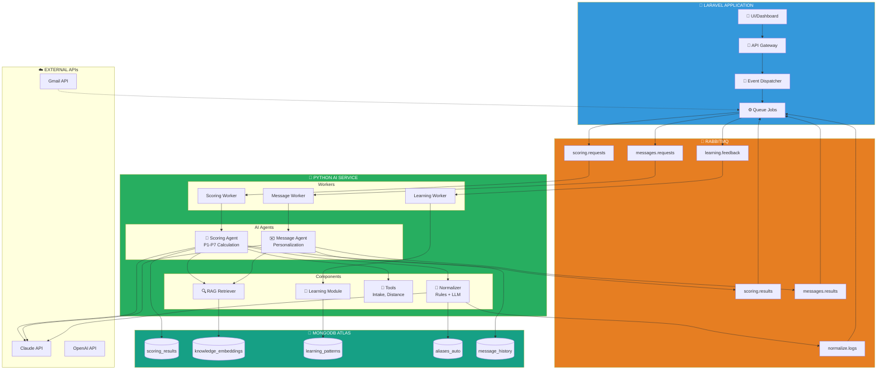

## 2. Scoring Data Flow

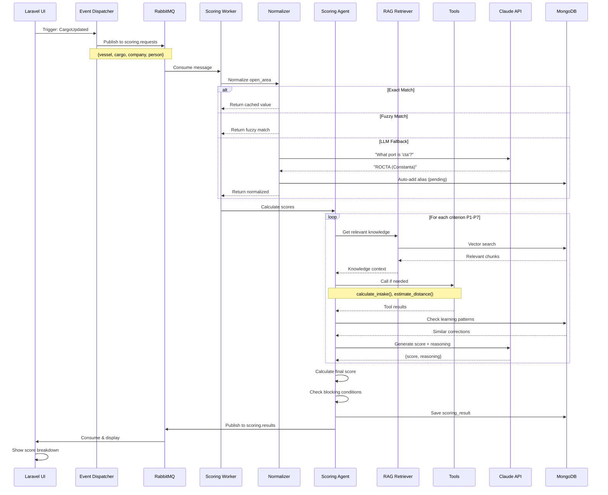

## 3. Normalization Pipeline

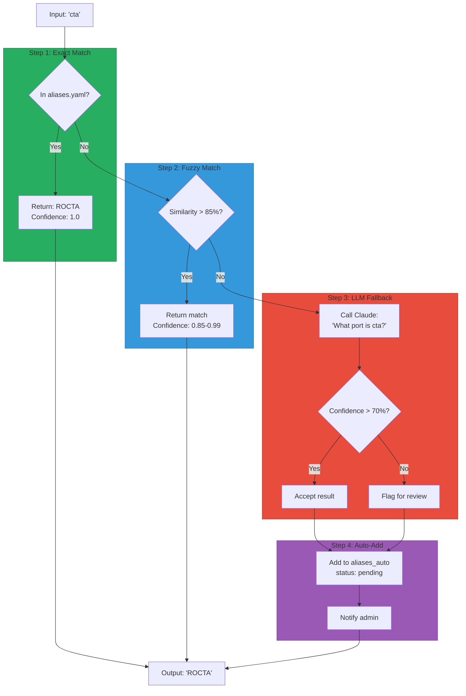

## 4. Learning Feedback Loop

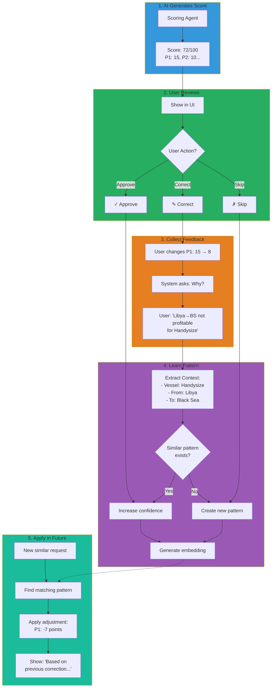

## 5. Message Generation Flow

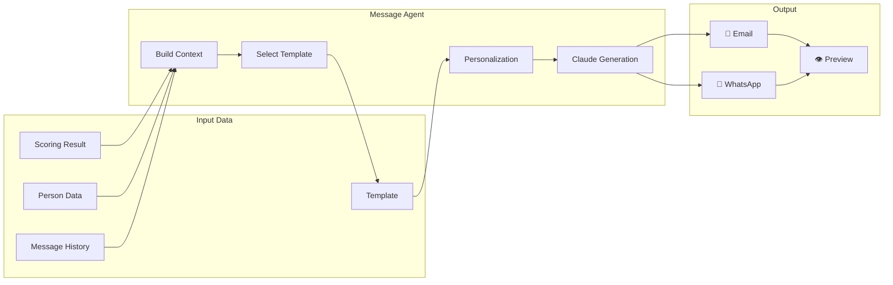

## 6. MongoDB Collections Relationship

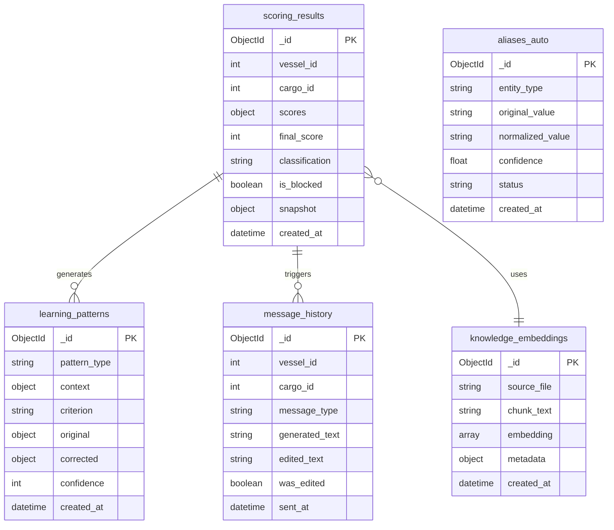

## 7. Implementation Timeline

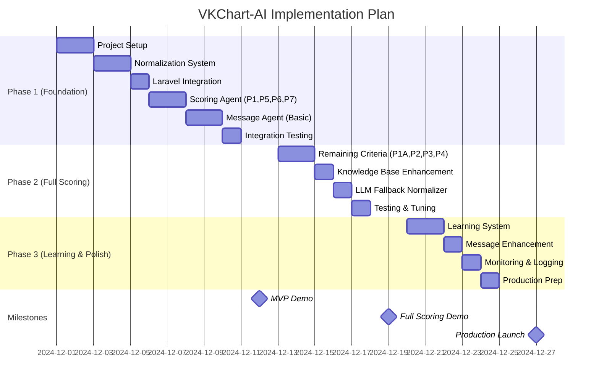

## 8. Trigger System

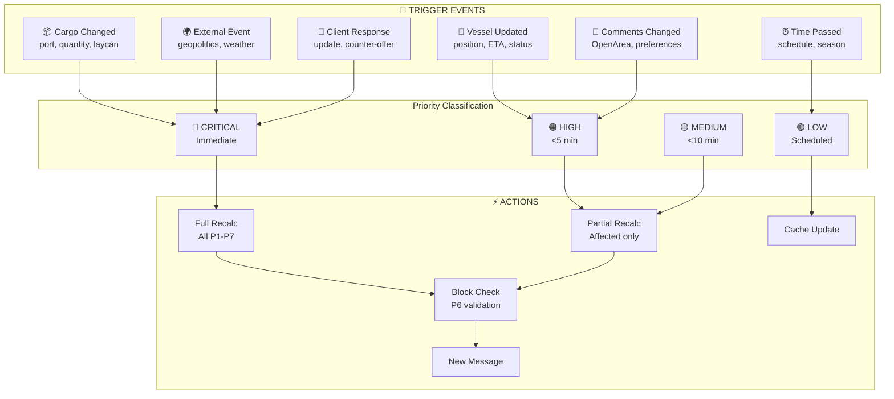

## 9. LangGraph & LangSmith Integration

### 9.1 LangGraph Scoring Workflow

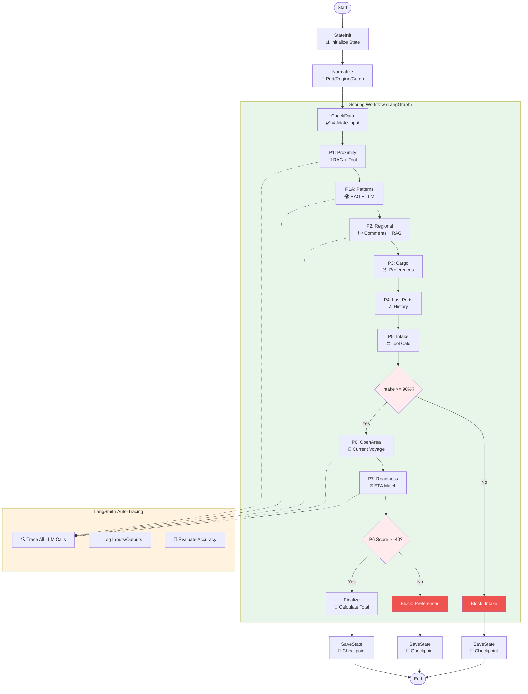

### 9.2 Human-in-the-Loop with Checkpoints

```mermaid
flowchart LR
    subgraph Original["Original Flow"]
        Start1["Start"] --> Score1["Calculate P1-P7"]
        Score1 --> Save1["SaveState<br/>💾 thread_id: 12345"]
        Save1 --> Show1["Show to User"]
    end
    
    subgraph UserReview["User Review"]
        Show1 --> Decision{"User Action?"}
        Decision -->|Approve| Done["Done ✅"]
        Decision -->|Correct| Correct["User changes<br/>P1: 15 → 8"]
    end
    
    subgraph Resume["Resume from Checkpoint"]
        Correct --> Load["LoadCheckpoint<br/>💾 thread_id: 12345"]
        Load --> Update["UpdateState<br/>🔄 P1 = 8"]
        Update --> Continue["Continue Workflow<br/>▶️ from P1A"]
        Continue --> Recalc["Recalculate Final<br/>📊 with new P1"]
        Recalc --> Show2["Show Updated Result"]
    end
    
    subgraph Learning["Learning Module"]
        Show2 --> LogCorrection["Log Correction<br/>🧠 Pattern"]
        LogCorrection --> Store["Store in<br/>learning_patterns"]
    end
    
    style Original fill:#e3f2fd
    style UserReview fill:#fff3e0
    style Resume fill:#e8f5e9
    style Learning fill:#f3e5f5
```

### 9.3 LangSmith Observability Stack

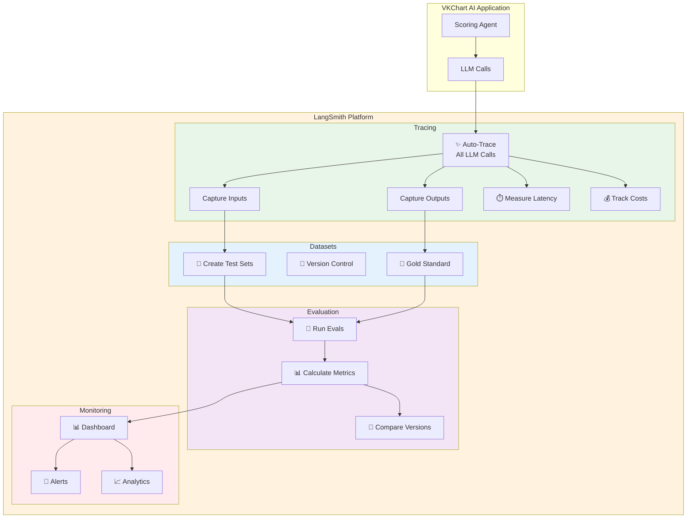

### 9.4 LangServe API Deployment

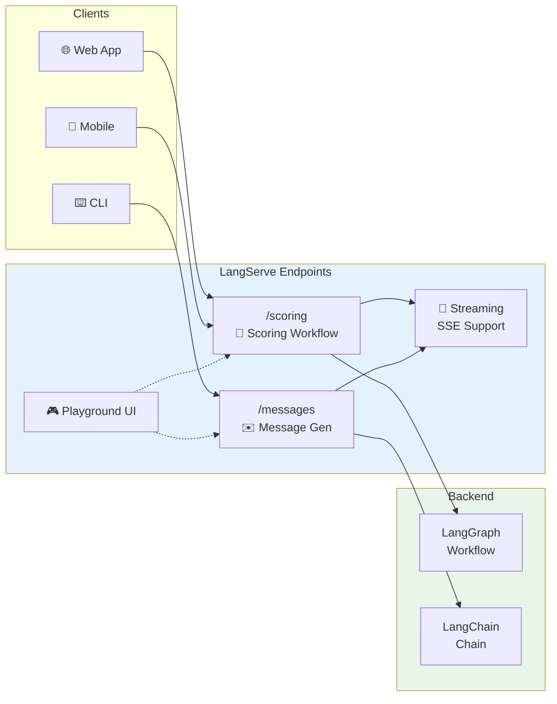
